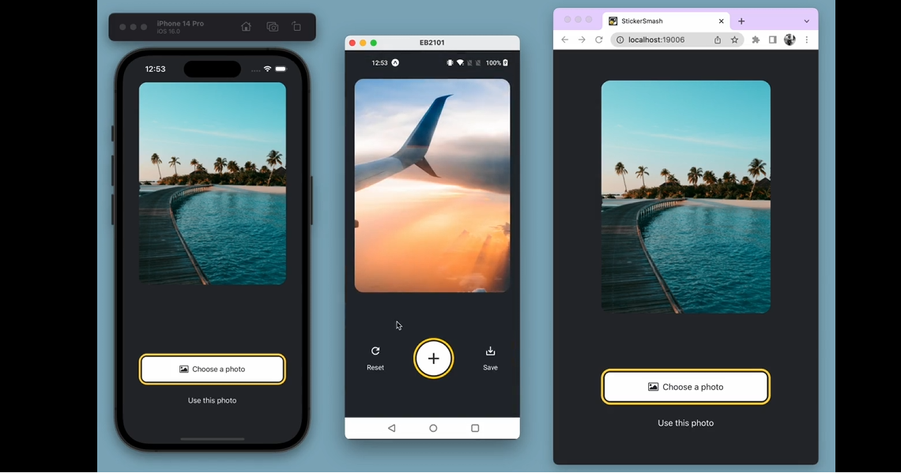

[Expo Official Tutorial](https://docs.expo.dev/tutorial/introduction/)



启动项目，参考 `package.json` 内的脚本命令。

构建流程:

`eas build --platform android`

得到 AAB (Android App Bundle) 文件，

```JavaScript
// 动态交付：Google Play根据设备配置生成优化的APK
// 更小的下载：用户只下载适合其设备的代码和资源
// 模块化：支持动态功能模块，按需下载
// 必需格式：2021年8月后Google Play要求使用AAB
```

从 AAB 文件获取 apk 文件:

在控制运行 `build-bat.bat`